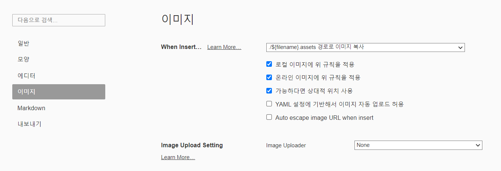

# Markup & Markdown

Markup : #대제목 내용

# 대제목 

## 중제목

### 소제목

제목 앞 #의 갯수로 구분


# 마크다운의 장점

1. 문법이 직관적이고 쉽다.
2. 관리가 쉽다.
3. 지원 가능한 플랫폼이 다양하다.

# 마크다운의 단점

1. 표준이 없다.
2. 처음 학습하는 코스트가 발생한다.
3. HTML 모든 마크업 기능을 대신할 수 없다. (일부만 대신할 수 있음)

# 주의사항

1. 마크다운의 본질은 글에게 `역할`(`백틱)을 부여하는 것. (제목, 리스트 등)
2. 정해진 역할에 맞는 문법을 사용해야 한다.  ex) 글씨를 키우기 위해 제목에 해당하는 역할을 부여하면 곤란하다.

# 마크다운 문법

`##` 로 작성했다가 Heading1로 변경하고 싶다면? `ctrl + 1`

1. 제목(Heading) : ctrl + 1 ~ 6


## 리스트 (목록)

1. 순서가 있는 목록 (숫자로 작성됨)

- 순서가 없는 목록 `-`

* 순서가 없는 목록 `*`
* `tab`키를 사용해서 들여쓰기가 가능하다.
  * `tab`으로 들여쓰기
* `shift + tap`으로 들여쓰기 취소 가능
  1. 순서가 없는 목록 안에 순서가 있는 목록 생성 가능

# 강조

1. **굵게** 
   1. ctrl + b
   2. `**`내용`**`
   3. `__`내용`__`
2. *기울임*
   1. ctrl + I
   2. `_`내용`_`
   3. `*`내용`*`
3. ~~취소~~
   1. `~~`내용`~~`
   2. Alt + shift + 5

# 코드 블럭

- 한줄 코드 `인라인 코드`와 여러줄 코드인 `블럭코드`로 나눌 수 있음.

1. 인라인 코드 : 백틱을 사용해서 코드를 감싸준다. 
2. 블럭 코드 : ```python 처럼 백틱을 3번 입력하고 코드의 종류를 작성한다.

```python
print("hello")
for i in range 10:
    print(i)
```

```html
<h1>
    자동완성 기능까지 있다.
</h1>
```

# 링크

- `[표시할 글자](이동할 주소)` 형태로 작성

[google](https://www.google.com)

- 이동하고자 한다면 ctrl + click

# 이미지

- ``
- 대체 텍스트란, 이미지가 정상적으로 불러와지지 않았을 때 표시되는 문구
- typora에는 이미지를 드래그 앤 드랍만으로도 적용시킬 수 있다.

## 주의사항

1. 이미지 업로드 전 저장하기
2. 

# 표

- `|` -> 파이프라인
- `ctrl + t` 단축기로 작성 (mac `option + command + t`)
- 행을 늘릴때는 `ctrl + enter`

|      |      |      |
| ---- | ---- | ---- |
|      |      |      |
|      |      |      |
|      |      |      |

---


# 구분선

- `---` 하이픈 3개

---


- `ctrl + /` : 마크다운 문법이 적용되지 않고 코드 그대로의 모습을 보여줌


