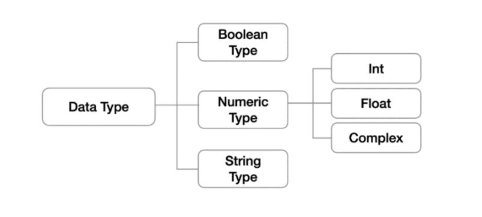
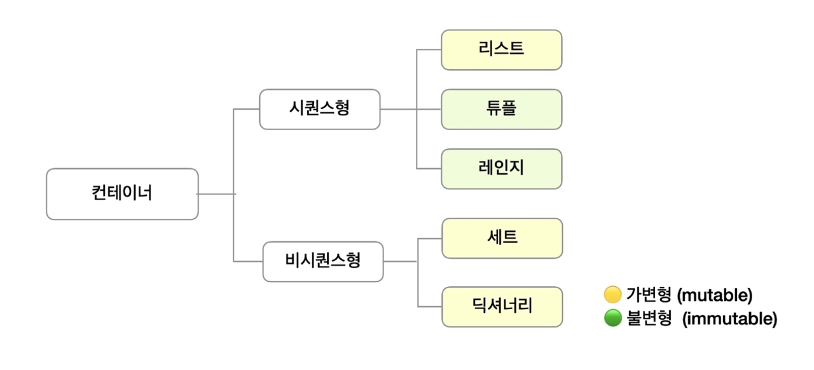

# Python

### 기초문법

- 변수
- =(assignment, 할당)
- 같은값을 동시에 할당할 수 도있고, 다른값을 동시에 할당할 수 있다.
- 변수에 할당된 값의 타입을 알고 싶을때는 `type`을 사용한다.

```python
x = 'ssafy'
x = y = 1004
x, y = 1, 2
type(x)
```

- Python Datatype

  

1. 불린형
   - True / False
   - 비교/논리 연산을 수행함에 있어서 활용
   - 0, 0.0, (), [], {}, '', None 은 모두 False로 변환
2. 정수형(int)
   - 모든 정수의 타입
   - 2진수 : 0b, 8진수 : 0o, 16진수 : 0x
3. 실수(Float)
   - 정수가 아닌 모든 실수
   - Floating point rounding error

```python
3.14 - 3.02 == 0.12 => false
3.14 - 3.02 => 0.120000000000001
```

4. 복소수(Complex)
   - 실수부와 허수부로 구성된 복소수는 모두 complex 타입

5. 문자열 (Str)
   - 모든 문자
   - Immutable(불변)
   - Iterable : 값이 순차적으로 1개씩 접근이 가능하다.
   - Escape sequence

   | 예약문자 | 내용              |
   | -------- | ----------------- |
   | `\n`     | 줄 바꿈           |
   | `\t`     | 탭                |
   | `\r`     | 캐리지리턴        |
   | `\0`     | 널(Null)          |
   | `\\`     | `\`               |
   | `\'`     | 단일인용부호(`'`) |
   | `\"`     | 이중인용부호(`"`) |

   - string interpolation

     1. %-formatting

     ```python
     name = 'kim'
     print('Hello, %s' % name)
     => Hello, Kim
     ```

     2. str.format()

     ```python
     name = 'kim'
     score = 4.5
     print('Hello, {}! 성적은 {}'.format(name, score))
     => Hello, Kim! 성적은 4.5
     ```

     3. f-strings

     ```python
     print(f'Hello, {name}! 성적은 {score}')
     ```


## 컨테이너

- 여러 개의 값을 담을 수 있는 객체로 **서로 다른 자료형**을 저장할 수 있음.

- 순서가 있는 데이터, 순서가 없는 데이터로 분류됨.



- 시퀸스형

  1. 리스트 (List)

  - 순서를 가지는 0개 이상의 객체를 참조하는 자료형
  - 생성된 이후 내용 변경이 가능
  - 항상 대괄호 `[]`형태로 출력
  - 대괄호 혹은 list()를 통해 생성
  - 순서가 있는 시퀸스로 인덱스를 통해 접근 가능

  

  	 	2. 튜플 (Tuple)

  - 순서를 가지는 0개 이상의 객체를 참조하는 자료형
  - 생성된 이후 내용 변경이 불가 -> 불변 자료형
  - 항상 소괄호 `()`형태로 출력
  - 소괄호 혹은 Tuple()를 통해 생성
  - 인덱스를 통해 접근 가능

  

  3. 레인지 (Range)

  - range(n, m, s) : n부터 m-1까지 s만큼 증가시키며 숫자의 시퀸스

  

- 비시퀸스형

  1. 셋(Set)

  - 순서없이 0개 이상의 해시가능한 객체를 참조하는 자료형
  - 해시가능한 객체만 담을 수 있음
  - 객체를 삽입, 변경, 삭제 가능 -> 가변 자료형
  - 집합연산 가능
  - 중복된 값이 존재하지 않음
  - 중괄호 `{}` 혹은 set()을 통해 생성

  

  2. 딕셔너리 (Dictionary)

  - 순서없이 Key-Value쌍으로 이뤄진 객체를 참조하는 자료형
  - Key : 해시가능한 불변 자료형만 가능
  - Value : 어떠한 형태든 관계 없음